# 🌿 AgroMeds

<p align="center">
  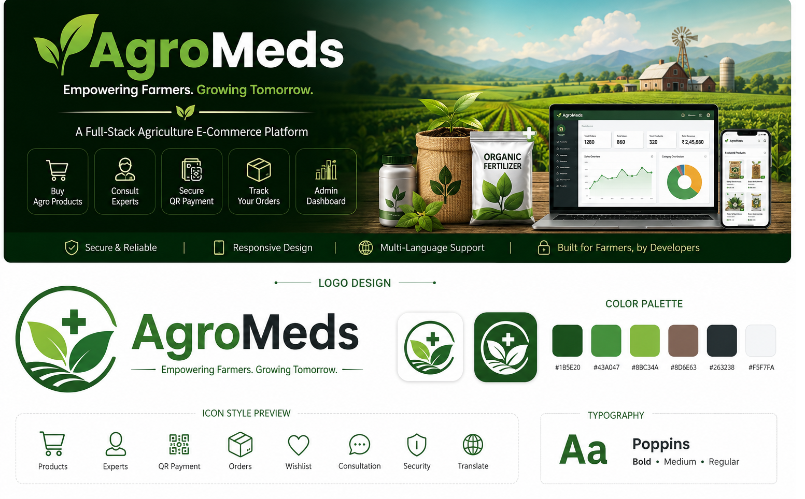
</p>

<h1 align="center">🌿 AgroMeds</h1>

<p align="center">
  <strong>A PHP & MySQL Based Agriculture E-Commerce Platform</strong>
</p>

<p align="center">
Helping users browse agricultural products, place orders, manage agricultural purchases, and connect with experts through a web-based platform.
</p>

<p align="center">
  
</p>

<p align="center">
  
  
  
  
  
  
</p>

---


------------------------------------------------------------------------

# 📑 Table of Contents

-   Overview
-   Problem Statement
-   Solution
-   Project Highlights
-   Core Features
-   Technology Stack
-   System Architecture
-   Project Structure
-   Security
-   Database Overview
-   Installation
-   Screenshots
-   Database Documentation
-   Authentication Flow
-   Product workflow
-   Admin Modules
-   Future Improvements

------------------------------------------------------------------------

# 📖 Overview

AgroMeds is a full-stack web application developed using PHP, MySQL,
Bootstrap and JavaScript.

The project provides a web interface where users can browse agricultural
products, manage a shopping cart, place orders, consult agricultural
experts and manage their profile. An administrator panel is included for
managing products, users, categories, orders and other application data.

------------------------------------------------------------------------

# 🎯 Problem Statement

Traditional purchasing of agricultural products often requires visiting
multiple stores and obtaining guidance from different sources. This
project brings product browsing, ordering and basic consultation into a
single web application.

------------------------------------------------------------------------

# 💡 Solution

AgroMeds provides one platform where users can discover products,
search, filter, place orders and interact with agriculture experts while
administrators manage the platform through a dedicated dashboard.

------------------------------------------------------------------------

# ✨ Project Highlights

-   Responsive Bootstrap interface
-   User registration and login
-   OTP email verification
-   Product search
-   Category filtering
-   Shopping cart
-   Wishlist
-   QR payment support
-   Cash on Delivery
-   Expert consultation
-   Google Translate integration
-   Admin dashboard
-   18 MySQL database tables

------------------------------------------------------------------------

# 🚀 Core Features

## User

-   Registration
-   Login
-   Profile Management
-   Browse Products
-   Product Search
-   Category Filtering
-   Wishlist
-   Shopping Cart
-   Checkout
-   QR Payment
-   Cash on Delivery
-   Order History
-   Expert Consultation
-   Feedback Submission

## Admin

-   Dashboard
-   Product Management
-   Category Management
-   User Management
-   Order Management
-   Payment Monitoring
-   Refund Monitoring
-   Testimonials
-   Contact Messages

------------------------------------------------------------------------

# 🛠 Technology Stack

  Category          Technology
  ----------------- --------------------------------------
  Frontend          HTML5, CSS3, Bootstrap 5, JavaScript
  Backend           PHP
  Database          MySQL
  Mail              PHPMailer
  Server            Apache (XAMPP)
  Version Control   Git & GitHub

------------------------------------------------------------------------

# 🏗 System Architecture

``` text
Browser
    │
    ▼
HTML • CSS • Bootstrap • JavaScript
    │
    ▼
PHP Backend
    │
    ▼
MySQL Database
```

------------------------------------------------------------------------

# 📂 Project Structure

```text
AgroMeds/
│
├── admin/          → Administrator Panel
├── assets/         → Static Assets
├── Images/         → Product Images
├── Uploads/        → Uploaded Files
├── screenshots/    → README Screenshots
├── vendor/         → Composer Libraries
├── downloads/      → Download Resources
│
├── *.php           → Application Pages & Business Logic
├── agriculture.sql → MySQL Database
├── README.md
└── LICENSE
```
------------------------------------------------------------------------

# 🔒 Security

-   Password hashing
-   Prepared SQL statements
-   Session authentication
-   OTP email verification
-   Server-side validation

------------------------------------------------------------------------

# 🗄 Database Overview

Database Name:

``` text
agriculture
```

The project uses 18 relational tables for managing users, products,
categories, orders, payments, consultations and other application data.

------------------------------------------------------------------------

# ⚙ Installation

## Requirements

-   PHP
-   MySQL
-   XAMPP
-   Git

## Clone

``` bash
git clone https://github.com/Vatsalladani/AgroMeds.git
```

Move the project to:

``` text
xampp/htdocs/Farming_meds
```

Create database:

``` text
agriculture
```

Import the SQL file, start Apache & MySQL, then open:

``` text
http://localhost/Farming_meds
```

------------------------------------------------------------------------

# 🖼 Screenshots

## 🏠 User Module

### Home Page

<p align="center">
  
</p>

### Login Page

<p align="center">
  
</p>

### Register Page

<p align="center">
  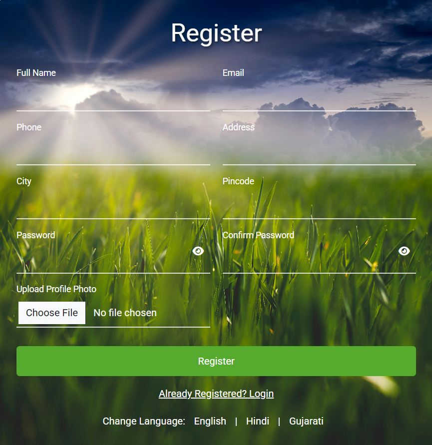
</p>

### Products Page

<p align="center">
  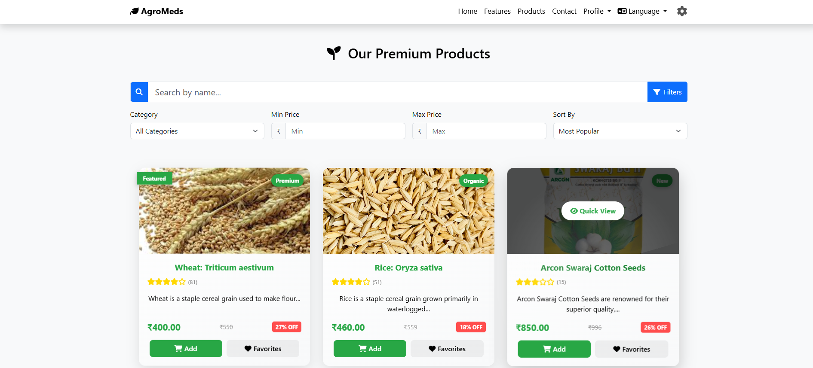
</p>

### Product Details

<p align="center">
  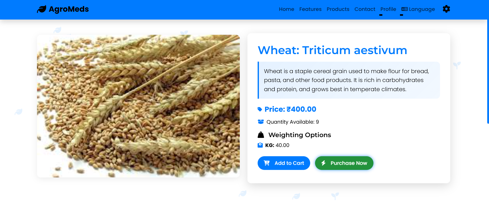
</p>

### Shopping Cart

<p align="center">
  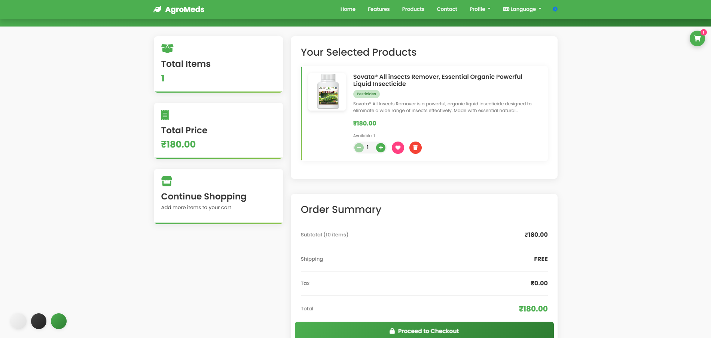
</p>

### Checkout

<p align="center">
  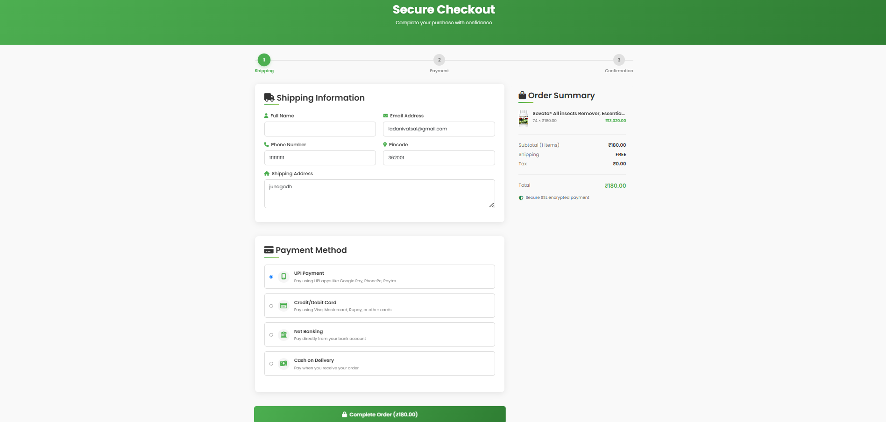
</p>

### Orders

<p align="center">
  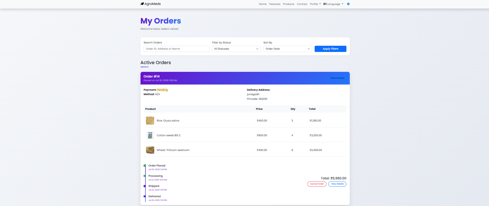
</p>

### User Profile

<p align="center">
  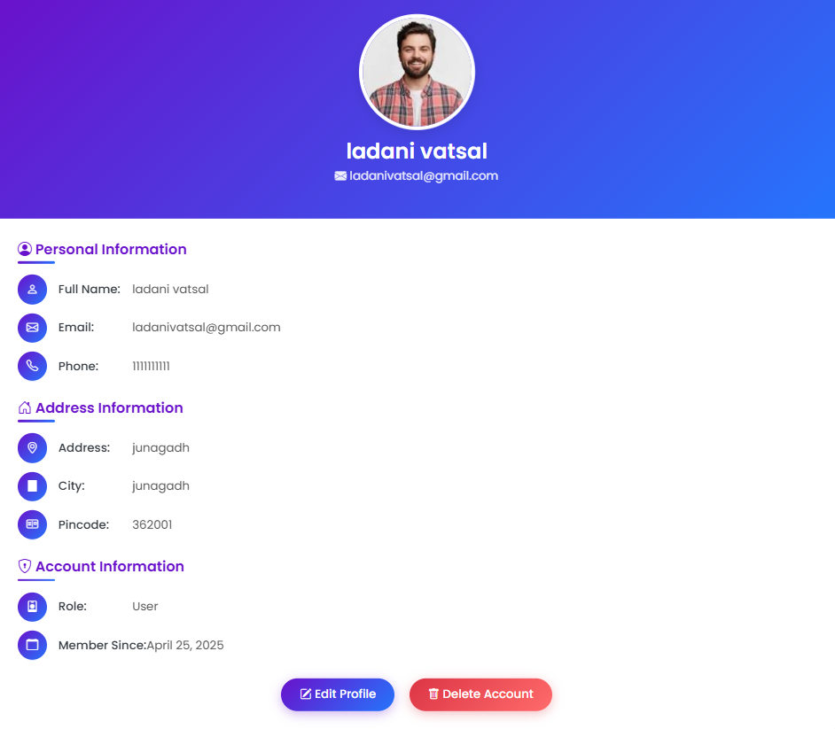
</p>

### Expert Profile

<p align="center">
  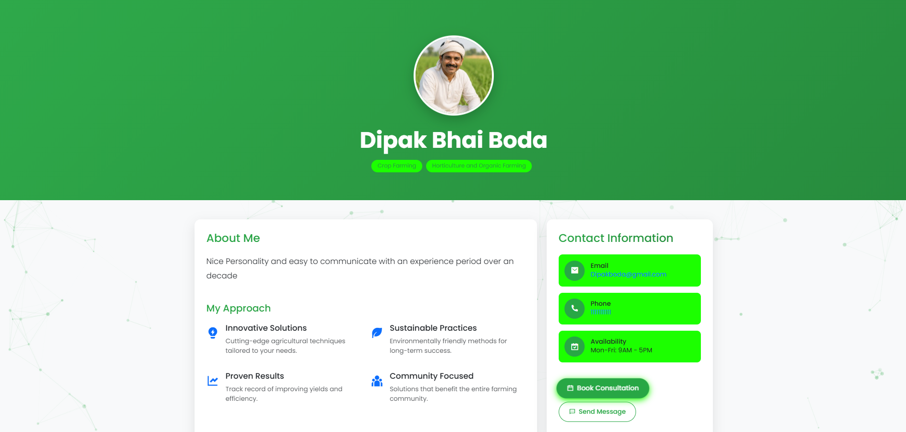
</p>

---

## 🛠 Admin Module

### Admin Login

<p align="center">
  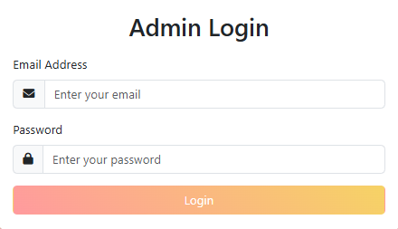
</p>

### Admin Dashboard

<p align="center">
  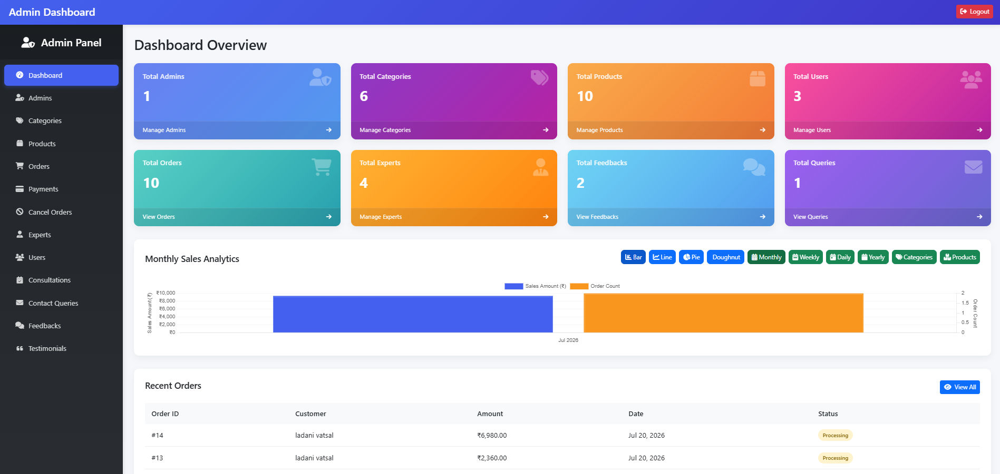
</p>

### Product Management

<p align="center">
  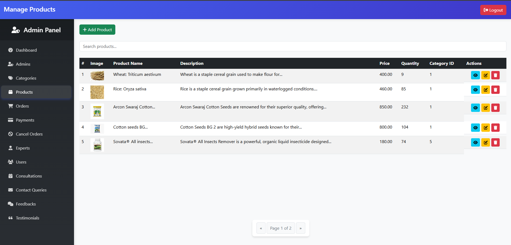
</p>

### Order Management

<p align="center">
  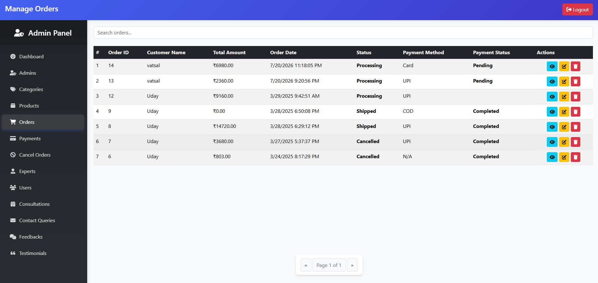
</p>

### User Management

<p align="center">
  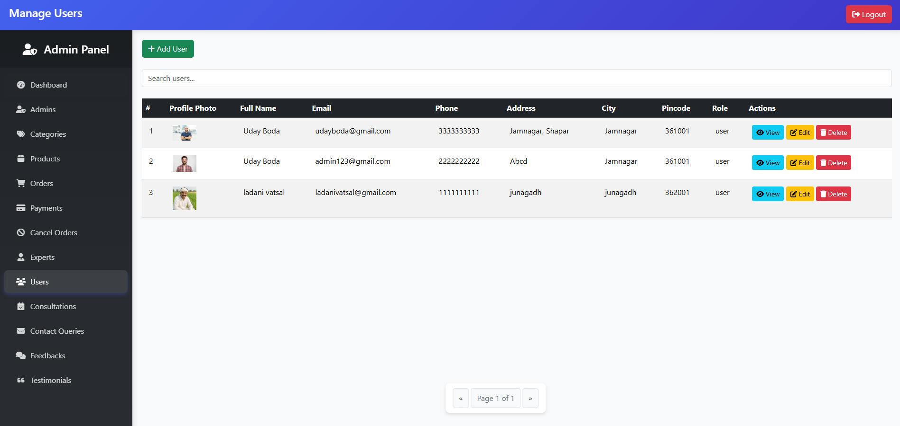
</p>

### Category Management

<p align="center">
  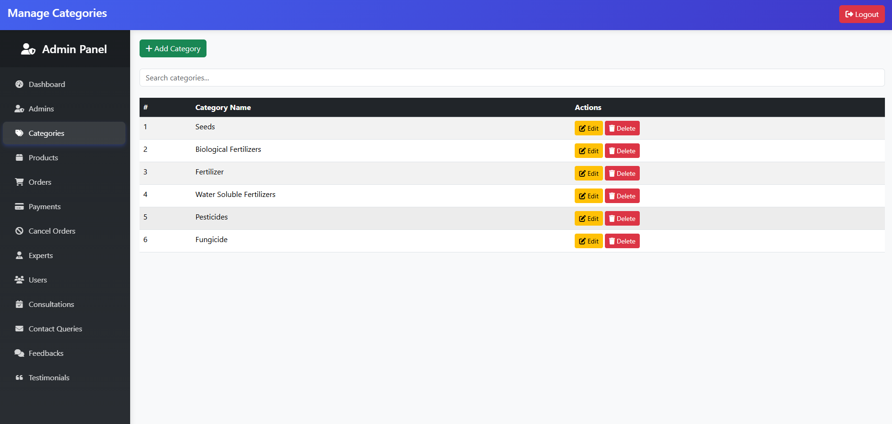
</p>

### Expert Management

<p align="center">
  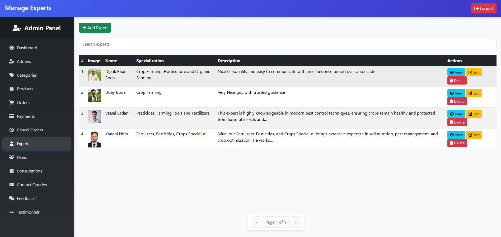
</p>

### Payment Management

<p align="center">
  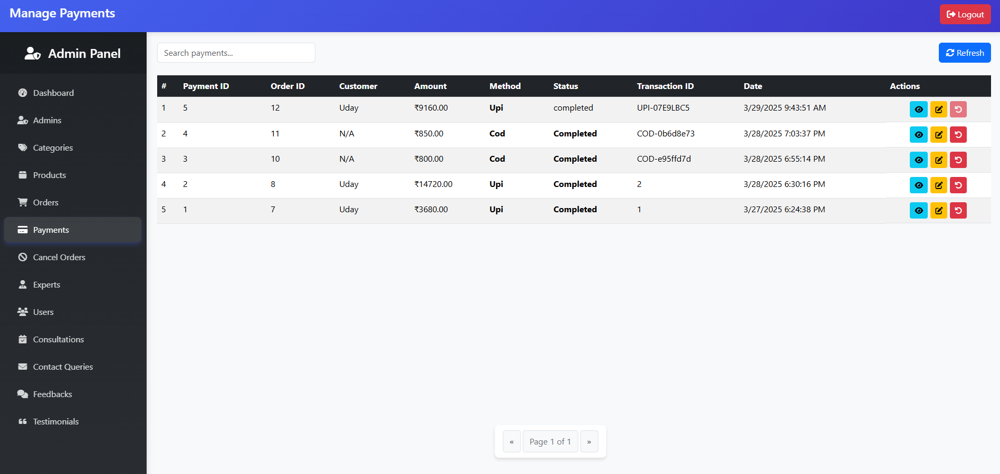
</p>

------------------------------------------------------------------------


# 🗄 Database Documentation

### Database Name

```text
agriculture
```

AgroMeds uses a **MySQL relational database** consisting of **18 relational tables** to manage users, products, orders, payments, consultations, and other application data.

### Database Tables

| Table | Purpose |
|--------|---------|
| `admin` | Stores administrator account information and login credentials. |
| `users` | Stores registered user accounts and profile information. |
| `products` | Stores agricultural product details. |
| `category` | Stores product categories. |
| `cart` | Stores products added to the shopping cart. |
| `favorites` | Stores favorite product records. |
| `user_favorites` | Maps users to their favorite products. |
| `orders` | Stores customer order information. |
| `order_items` | Stores products associated with each order. |
| `payments` | Stores payment details and transaction records. |
| `refunds` | Stores refund request information. |
| `cancel_orders` | Stores cancelled order records. |
| `experts` | Stores agriculture expert profiles. |
| `consultations` | Stores consultation requests between users and experts. |
| `feedback` | Stores user feedback submitted through the platform. |
| `testimonials` | Stores customer testimonials. |
| `contactus` | Stores messages submitted through the contact form. |
| `email_log` | Stores email activity and notification logs. |

------------------------------------------------------------------------

# 🔐 Authentication Flow

``` text
User Registration
        │
        ▼
OTP Verification
        │
        ▼
Password Stored (Hashed)
        │
        ▼
User Login
        │
        ▼
Session Created
```

Authentication includes:

-   User registration
-   Login
-   OTP verification
-   Password hashing
-   Session-based authentication

------------------------------------------------------------------------

# 🛒 Product Workflow

``` text
Browse Products
      │
      ▼
Search / Filter
      │
      ▼
Product Details
      │
      ▼
Add to Cart
      │
      ▼
Checkout
      │
      ▼
Place Order
```

Available product operations:

-   Browse products
-   Search products
-   Filter by category
-   Wishlist support
-   View product details

------------------------------------------------------------------------

# 🛍 Shopping Cart

The cart module allows users to:

-   Add products
-   Update quantity
-   Remove products
-   View subtotal
-   Proceed to checkout

------------------------------------------------------------------------

# 💳 Payment Module

Supported payment methods:

-   QR Code Payment
-   Cash on Delivery (COD)

Typical flow:

``` text
Checkout
   │
   ▼
Select Payment Method
   │
   ▼
Payment Record
   │
   ▼
Order Confirmation
```

------------------------------------------------------------------------

# 👨‍🌾 Expert Consultation

Users can:

-   View experts
-   Send consultation requests
-   Receive agriculture guidance through the platform

------------------------------------------------------------------------

# 📊 Admin Module

The administrator panel provides management for:

-   Dashboard
-   Products
-   Categories
-   Users
-   Orders
-   Payments
-   Refunds
-   Experts
-   Testimonials
-   Feedback
-   Contact Messages

------------------------------------------------------------------------

# 📂 Important Modules

## User Module

-   Registration
-   Login
-   Profile
-   Orders

## Product Module

-   Product browsing
-   Product details
-   Search
-   Filtering

## Cart Module

-   Cart management
-   Checkout

## Payment Module

-   QR payment
-   Cash on Delivery

## Consultation Module

-   Agriculture experts
-   Consultation requests

## Admin Module

-   Manage application data

------------------------------------------------------------------------

# ⚠ Known Limitations

Current implementation does not include:

-   REST API
-   Docker support
-   Mobile application
-   Automated deployment
-   Unit testing

------------------------------------------------------------------------

# 🚀 Future Improvements

Possible future enhancements:

-   REST API
-   Mobile application
-   Payment gateway integration
-   Push notifications
-   Email notifications
-   AI-based crop recommendations
-   Weather integration

------------------------------------------------------------------------

# 👨‍💻 Author

**Vatsal Ladani**

MSc IT Student

Aspiring Software Engineer

GitHub: https://github.com/Vatsalladani

------------------------------------------------------------------------

# 📄 License

This project is licensed under the MIT License.

------------------------------------------------------------------------

# 🙏 Thank You

Thank you for exploring the AgroMeds project.

If you found this repository useful, consider giving it a ⭐ on GitHub.
